
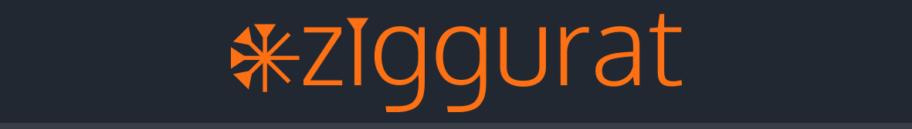

**ziggurat** is a web-based cuneiform slate with a modern, intuitive, and responsive interface. Fluidly and neatly inscribe cuneiform signs without the hassle of complex fonts or cumbersome paper-and-pencil. Intended to be simple to use, **ziggurat** makes writing cuneiform as easy as natively writing on clay - just click, drag, and repeat.

## Table of Contents
- [Usage](#id-usage)
- [Phone & Tablet Usage](#id-mobile)
- [Gallery](#id-gallery)
- [Licenses & Dependencies](#id-licenses)

## 
Usage
**ziggurat** comes with just 8 simple controls, each with a dedicated hotkey to further expedite the cuneiform writing experience. No complex multi-tools or confusing menus necessary.

### 1) Wedge Tool
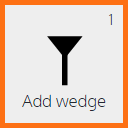
<b>Hotkey: 1</b>  Use this tool to draw wedges by clicking and dragging. The position of the mouse cursor relative to the start point determines both the wedge's orientation and length.

### 2) Hook Tool
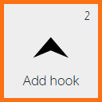
<b>Hotkey: 2</b>  Use this tool to draw hooks (<i>Winkelhaken</i>) by clicking and dragging. The position of the mouse cursor relative to the start point determines the hook's orientation.

### 3) Rotate Tool
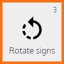
<b>Hotkey: 3</b>  Use this tool to adjust the rotation and length of different signs. Click on a sign to select it, and drag to adjust its orientation, and if applicable, its length. While in this mode, use <b>delete</b> to remove a selected sign.

### 4) Move Tool
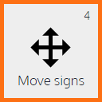
<b>Hotkey: 4</b>  Use this tool to move different signs around the canvas. Click on a sign to select it, and drag to change its position. While in this mode, use <b>delete</b> to remove a selected sign.

### 5) Angle Discretization
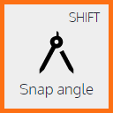
<b>Hotkey: SHIFT</b>  When activated, this option forces the angles of all signs to be multiples of 45&deg;. Hold the hotkey to temporarily enable angle discretization.

### 6) Length Discretization
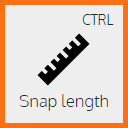
<b>Hotkey: CTRL</b>  When activated, this option only allows certain lengths for wedges. Hold the hotkey to temporarily enable length discretization.

### 7) Sign Depth
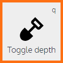
<b>Hotkey: q</b>  This option allows the user to switch between creating deeper (larger) signs and shallower (smaller) signs. &nbsp;

### 8) Clear Canvas
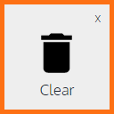
<b>Hotkey: x</b>  Removes all signs from the canvas and resets it to its original state. &nbsp;

## 
Phone & Tablet Usage
For users of devices with smaller screens, **ziggurat** will switch to a more compact layout to save space. In mobile mode, tap the menu button at the bottom left to expand and collapse the tool menu.

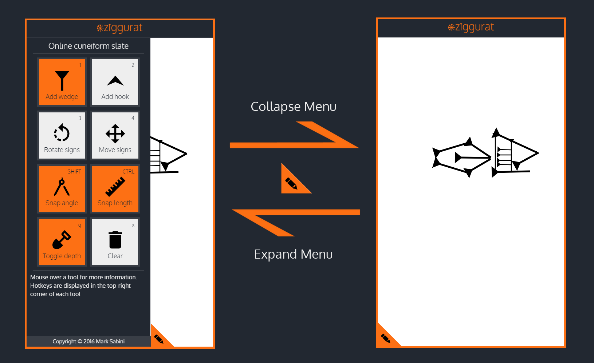

## 
Gallery
Below is an assortment of signs written using **ziggurat**, accompanied by their corresponding values:

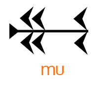&nbsp;&nbsp;&nbsp;&nbsp;&nbsp;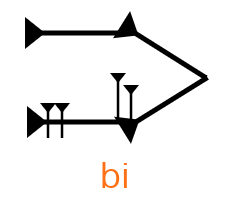&nbsp;&nbsp;&nbsp;&nbsp;&nbsp;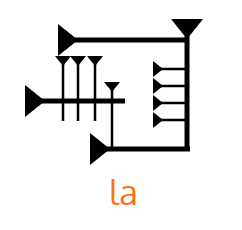

## 
Licenses & Dependencies
 * **ziggurat** is licensed under the [MIT license](LICENSE).
 * *Paper.js* was used for drawing vector graphics and is licensed under the [MIT license](LICENSE).
